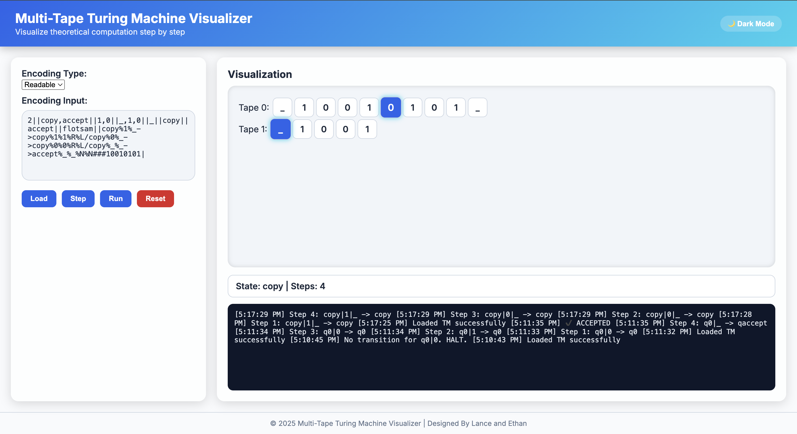

Multi-Tape Turing Machine Visualizer

An interactive web-based Turing Machine simulator that lets you visualize multi-tape computations step-by-step.
Built entirely in HTML, CSS, and JavaScript, it provides an elegant interface, light/dark theme toggle, and real-time tape visualization for educational use.

Features

✅ Multi-Tape Simulation — Supports single and multi-tape machines

✅ Readable Encoding Format — Paste custom machine definitions using a structured format

✅ Step-by-Step Execution — Run the machine manually or continuously

✅ Light/Dark Mode — Toggle for visual comfort

✅ Interactive Visualization — See tape movement and head transitions live

✅ Error Handling — Catches invalid formats and guides you with alerts

✅ Educational Design — Ideal for students learning automata theory and computation models

 Demo Screenshot

(Optional — include if you host an image later)

📂 Project Structure
📦 multi-tape-tm-visualizer

│

├── index.html          # Main application (all-in-one file)

├── README.md           # Documentation file

└── examples.txt        # (Optional) Encoded TM examples

 How It Works
1️⃣ Encoding Format

The simulator accepts readable Turing Machine encodings in this structure:

<number_of_tapes>||
<states>||
<input_alphabet>||
<tape_alphabet>||
<blank_symbol>||
<start_state>||
<accept_states>||
<reject_states>||
<transitions>###<initial_tape_input>

Example:

1||q0,qaccept||1,_||1,_||_||q0||qaccept||qreject||
q0%1->q0%1%R/q0%_->qaccept%1%N###111

💡 This TM scans across all 1s and adds one more 1 to the end (111 → 1111).

2️⃣ Transition Format

Each transition uses this structure:

currentState%readSymbol->nextState%writeSymbol%MoveDirection

% separates parts of the rule

/ separates multiple rules

R = move right, L = move left, N = no movement

Example:

q0%1->q0%1%R/q0%_->qaccept%1%N

3️⃣ Running the Simulation

Open index.html in any modern browser

Choose Encoding Type → Readable

Paste your machine definition into the textarea

Click Load to initialize

Use:

🟦 Step — Execute one transition at a time

▶️ Run — Automatically run through transitions

🔁 Reset — Clear and start fresh

You’ll see:

Tape(s) visualized dynamically

Current head position

Active state and step count

Logs of transitions executed

🎨 UI / UX Features

Clean modern interface using CSS variables for theming

Responsive grid layout (mobile-friendly)

Animated tape cells and glowing head indicator

Smooth dark/light theme toggle (🌙 / ☀️)

Real-time status and event log console

🐞 Common Errors and Fixes
Issue	Cause	Fix
❌ “Invalid code format”	Missing or extra `	

⚠️ “Load TM first”	Tried to Step/Run before clicking Load	Always click “Load” after pasting code

🧩 Machine halts too early	No matching transition for current state/symbol	Add a rule to handle that symbol or check direction logic

🌓 Theme not toggling	Cached older file or JavaScript disabled	Clear cache / enable JavaScript

🧠 Example Encodings

Unary Increment (adds 1)

1||q0,qaccept||1,_||1,_||_||q0||qaccept||qreject||
q0%1->q0%1%R/q0%_->qaccept%1%N###111

Replace 0s with 1s

1||q0,qaccept||0,1,_||0,1,_||_||q0||qaccept||qreject||
q0%0->q0%1%R/q0%1->q0%1%R/q0%_->qaccept%_%N###010

Unary Decrement

1||q0,q1,qaccept||1,_||1,_||_||q0||qaccept||qreject||
q0%1->q0%1%R/q0%_->q1%_%L/q1%1->qaccept%_%N###111

🛠️ Technologies Used

HTML5 – structure

CSS3 – responsive UI and theming

Vanilla JavaScript (ES6) – TM logic and dynamic rendering

Google Fonts (Inter) – clean typography

👨‍🏫 Educational Use

This project is ideal for:

Students learning Automata Theory or Formal Languages

Teachers demonstrating Turing Machine computation visually

Developers exploring simulation-based learning tools

💬 Future Improvements

🔁 Add Base64 encoding/decoding support

🧮 Step speed slider

💾 Save/Load Turing Machines from localStorage

🌐 Online sharing of machine definitions

🧑‍💻 Author

Developed by: [Your Name or GitHub Username]
Year: 2025
License: MIT

“An elegant way to bring theoretical computer science to life.”
